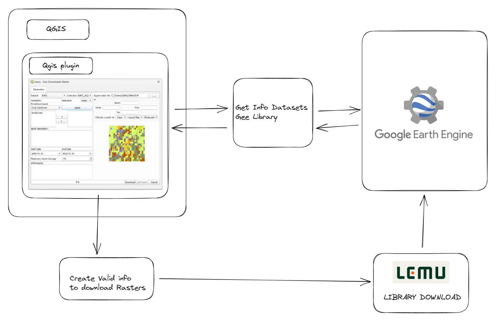
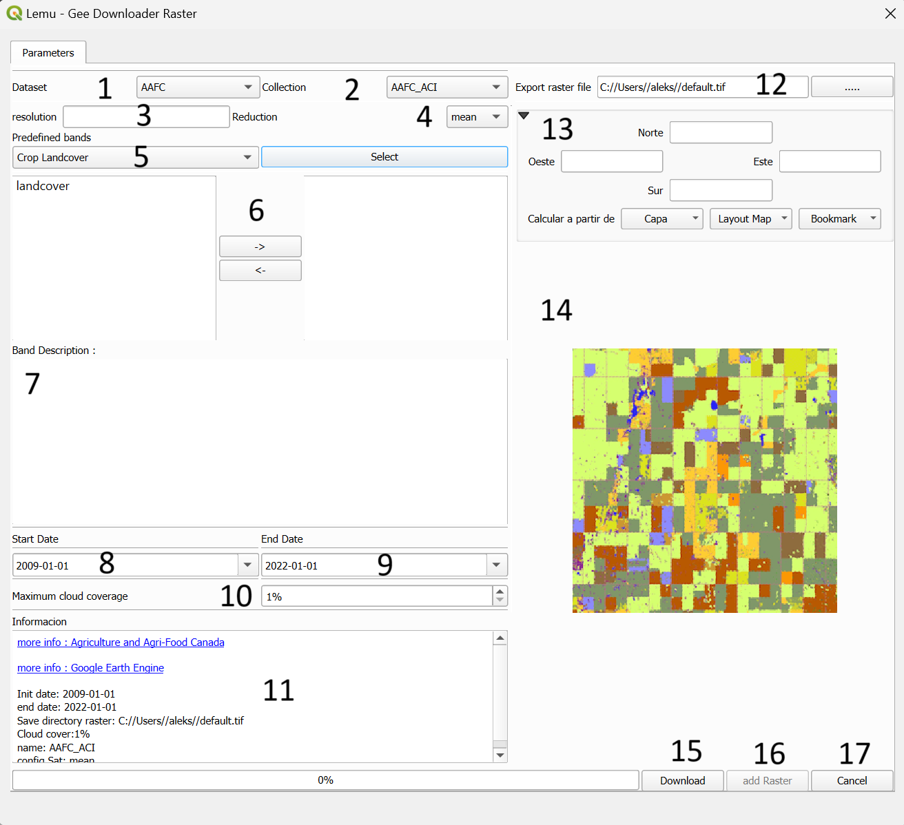

# download_raster

## Getting started

This plugin allows you to download rasters from Google Earth Engine using a shapefile as a region of interest. With this tool, users can select a specific area of interest defined in a shapefile and easily retrieve raster image data. Follow the steps below to use the plugin:

* Install the plugin in QGIS.

* Open QGIS and load your shapefile that defines the region of interest.

* Activate the plugin and select the shapefile as the region of interest.

* Enter the required parameters, such as the date and image type.

* Click 'Download' to obtain the raster data from Google Earth Engine.

This plugin simplifies the extraction of precise and up-to-date geospatial data for your analysis in QGIS. Enjoy using it and explore new opportunities for your geospatial projects!"

## dependencies
Account valid in https://earthengine.google.com/

### Plugins

Pre installed plugin GEE in QGIS https://plugins.qgis.org/plugins/ee_plugin/ 

### Library
Retry

Tqdm

rasterio

## Installation
Before installing this plugin, it is necessary to pre-install the Google Earth Engine plugin. This plugin will be automatically installed at the time of installing 'download_raster' plugin.

## How to download? (Workflow)
Once the plugin is installed in QGIS, it makes requests to retrieve dataset information and display it, as well as to generate valid information for downloading.

## Usage
 

###  Descriptions
1.-  List of available datasets 

2.-  List of dataset collections

3.-  Change pixel resolution in meters (default 100 meters)

4.-  Type of reduction (mean, mosaic, first image)

5.-  Predefined bands 

6.-  Selector single bands

7.-  Bands descriptions

8.-  Start date

9.-  End date

10.- Maximun cloud coverage 

11.- Download information

12.- Path to export raster file

13.- Extend bounding box

14.- Preview collection image

15.- download button 

16.- Add raster to TOC button

17.- Cancel download button

## Tipical Errors or Bugs

Note: This README is currently under construction. Additional information and details will be added soon. Thank you for your understanding.

